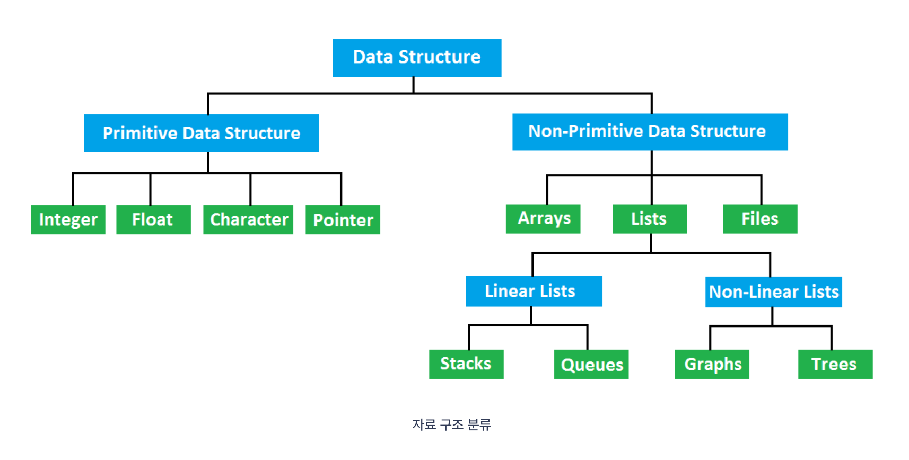

## why should we learn data structure?

자료구조는 기본적으로 제한적인 메모리 공간을 어떻게 효율적으로 사용해야 하는 것인가에 대한 것이다. (+ 실행 시간의 효율성)

모든 목적에 맞는 자료구조는 없으며, 각 자료구조가 갖는 장점과 한계를 잘 아는 것이 중요하다.

공부할 필수 자료구조는 총 8개로 다음과 같다.

- Array
- Linked List
- Stack
- Queue
- Hash Table
- Graph
- Tree
- Heap

## References

- https://bnzn2426.tistory.com/115

- https://towardsdatascience.com/8-common-data-structures-every-programmer-must-know-171acf6a1a42
